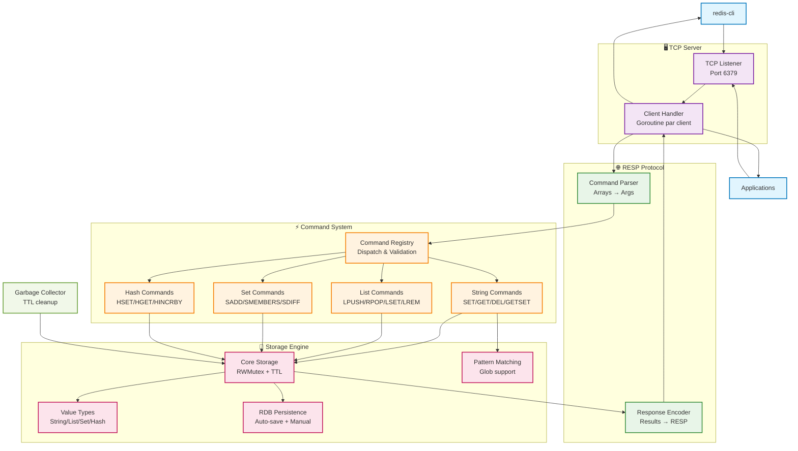

# Redis-Go
[](https://golang.org/)
[](https://docker.com/)
[](https://www.typescriptlang.org/)
> Implémentation Redis avancée en Go avec protocole RESP (REdis Serialization Protocol) et support complet des types de données courants.

## 👨‍💻 Équipe de développement
|   **Développeur**    | **Classe** |
|:--------------------:|:----------:|
| **ALLARD Alexandre** | **`5IW2`** |
|  **GRANDIN Victor**  | **`5IW2`** |
|  **NKUMBA Estelle**  | **`5IW2`** |

## Fonctionnalités

### Types de données
- **Strings** avec TTL et opérations atomiques (INCR/DECR, GETSET, GETDEL)
- **Lists** bidirectionnelles avec manipulation avancée (LSET, LREM, LINSERT, LTRIM)
- **Sets** pour collections uniques avec opérations ensemblistes (SDIFF, SINTER, SUNION)
- **Hashes** pour objets structurés avec incréments numériques

### Protocole / Implémentation
- **RESP complet** compatible Redis
- **Pattern matching** avancé pour KEYS
- **Garbage collection** automatique des TTL
- **Persistence RDB** avec sauvegarde automatique

---

## Démarrage rapide

### Docker (Compose)

#### Démarrage
```bash
git clone <repository-url> && cd redis-go
make run
make cli  # Dans un autre terminal
```

#### Rédémarrage rapide (avec build)
```bash
make restart
```

### Go natif
```bash
go mod tidy && go run main.go
redis-cli -p 6379  # Test
```

### Premier test
```bash
SET welcome "Coucou Redis en GO !!" EX 3600
GET welcome
ALAIDE  # Voir toutes les commandes
```

---

## Architecture

### Structure du projet
```
redis-go/
├── main.go                    # Point d'entrée
├── internal/
│   ├── config/               # Configuration serveur
│   ├── protocol/             # Parser/Encoder RESP
│   ├── commands/             # Handlers de commandes
│   ├── storage/              # Moteur de stockage
│   ├── persistence/          # Système RDB
│   └── server/               # Serveur TCP + lifecycle
├── Dockerfile                # Image Docker
├── compose.yml
└── Makefile                 # Commandes dev
```

### Flux de données



---

## API des commandes

### Strings & Compteurs
| Commande | Syntaxe | Description |
|----------|---------|-------------|
| `SET` | `SET key value [EX seconds]` | Stocke avec TTL optionnel |
| `GET` | `GET key` | Récupère une valeur |
| `DEL` | `DEL key [key ...]` | Supprime des clés |
| `INCR` | `INCR key` | Incrémente de 1 |
| `INCRBY` | `INCRBY key increment` | Incrémente par N |
| `GETSET` | `GETSET key value` | Atomique: GET ancien + SET nouveau |
| `MSETNX` | `MSETNX key value [key value ...]` | Multi-set si AUCUNE clé existe |
| `GETDEL` | `GETDEL key` | Atomique: GET puis DELETE |

### Listes avancées
| Commande | Syntaxe | Description |
|----------|---------|-------------|
| `LPUSH` | `LPUSH key element [element ...]` | Ajoute au début |
| `RPUSH` | `RPUSH key element [element ...]` | Ajoute à la fin |
| `LPOP` | `LPOP key` | Retire du début |
| `LLEN` | `LLEN key` | Longueur de liste |
| `LRANGE` | `LRANGE key start stop` | Sous-ensemble |
| `LSET` | `LSET key index element` | Définit élément à index |
| `LREM` | `LREM key count element` | Supprime occurrences |
| `LINSERT` | `LINSERT key BEFORE\|AFTER pivot element` | Insère avant/après pivot |
| `LTRIM` | `LTRIM key start stop` | Garde seulement la plage |

### Sets avec opérations ensemblistes
| Commande | Syntaxe | Description |
|----------|---------|-------------|
| `SADD` | `SADD key member [member ...]` | Ajoute des membres |
| `SMEMBERS` | `SMEMBERS key` | Liste tous les membres |
| `SREM` | `SREM key member [member ...]` | Supprime des membres |
| `SCARD` | `SCARD key` | Nombre de membres |
| `SDIFF` | `SDIFF key [key ...]` | Différence de sets |
| `SINTER` | `SINTER key [key ...]` | Intersection de sets |
| `SUNION` | `SUNION key [key ...]` | Union de sets |

### Hashes enrichis
| Commande | Syntaxe | Description |
|----------|---------|-------------|
| `HSET` | `HSET key field value [field value ...]` | Définit des champs |
| `HGET` | `HGET key field` | Récupère un champ |
| `HGETALL` | `HGETALL key` | Tous les champs/valeurs |
| `HEXISTS` | `HEXISTS key field` | Teste existence d'un champ |
| `HDEL` | `HDEL key field [field ...]` | Supprime des champs |
| `HLEN` | `HLEN key` | Nombre de champs |
| `HKEYS` | `HKEYS key` | Tous les noms de champs |
| `HVALS` | `HVALS key` | Toutes les valeurs |
| `HINCRBY` | `HINCRBY key field increment` | Incrémente champ entier |
| `HINCRBYFLOAT` | `HINCRBYFLOAT key field increment` | Incrémente champ float |

### Utilitaires & Persistence
| Commande | Syntaxe | Description |
|----------|---------|-------------|
| `KEYS` | `KEYS pattern` | Recherche par motif (* ? [abc]) |
| `PING` | `PING [message]` | Test de connexion |
| `DBSIZE` | `DBSIZE` | Nombre de clés |
| `SAVE` | `SAVE` | Sauvegarde synchrone |
| `BGSAVE` | `BGSAVE` | Sauvegarde en arrière-plan |
| `ALAIDE` | `ALAIDE [commande]` | Aide interactive |

---

## Configuration

### Variables d'environnement
```bash
REDIS_HOST=0.0.0.0              # Adresse d'écoute
REDIS_PORT=6379                 # Port du serveur
REDIS_MAX_CONNECTIONS=1000      # Connexions simultanées
REDIS_EXPIRATION_CHECK_INTERVAL=1  # GC interval (secondes)
REDIS_RDB_ENABLED=true          # Activer persistence RDB
REDIS_RDB_FILE=./data/dump.rdb  # Fichier de sauvegarde
REDIS_RDB_SAVE_INTERVAL=300     # Auto-save intervalle (secondes)
REDIS_RDB_SAVE_ON_EXIT=true     # Sauvegarder à l'arrêt
```

### Docker Compose
```yaml
services:
  redis-go:
    build: .
    ports:
      - "6379:6379"
    environment:
      - REDIS_MAX_CONNECTIONS=2000
      - REDIS_RDB_SAVE_INTERVAL=600
    restart: unless-stopped
    volumes:
      - redis-data:/app/data
```

---

## Développement

### Commandes Make
```bash
# Serveur
make help    # Affiche toutes les commandes disponibles
make run     # Démarre le serveur
make cli     # Client redis-cli interactif
make test    # Lance les tests
make restart # Redémarre complètement
```

---

## Exemples d'usage avancés

### Cache avec opérations atomiques
```bash
SET counter "10" EX 3600
INCRBY counter 5
GETSET counter "0"  # Récupère 15 et remet à 0
```

### Manipulation de listes
```bash
RPUSH tasks "email" "backup" "cleanup"
LINSERT tasks BEFORE "backup" "prepare"
LREM tasks 1 "cleanup"  # Supprime 1 occurrence
LTRIM tasks 0 2         # Garde seulement les 3 premiers
```

### Opérations sur les sets
```bash
SADD users:online "alice" "bob" "charlie"
SADD users:premium "alice" "david"
SINTER users:online users:premium  # Utilisateurs premium en ligne
SDIFF users:online users:premium   # Utilisateurs gratuits en ligne
```

### Hashes avec calculs
```bash
HSET user:123 name "Alice" score "100" level "5"
HINCRBY user:123 score 50        # score = 150
HINCRBYFLOAT user:123 level 0.5  # level = 5.5
HGETALL user:123
```

### Persistence et monitoring
```bash
BGSAVE                # Sauvegarde en arrière-plan
INFO persistence      # Statistiques RDB
DBSIZE               # Nombre de clés actives
```

---

## Comparaison avec Redis officiel

### ✅ Fonctionnalités supportées
- **Protocole RESP** - 100% compatible
- **Types de base** - String, List, Set, Hash
- **TTL & Expiration** - Support complet
- **Pattern matching** - KEYS avec glob patterns
- **Persistence RDB** - Sauvegarde/restauration
- **Commandes avancées** - 60+ commandes implémentées

### 🔄 En développement
- **Sorted Sets** (ZADD, ZRANGE, ZRANK)
- **Pub/Sub** (PUBLISH, SUBSCRIBE)
- **Transactions** (MULTI, EXEC, WATCH)
- **Lua scripting** (EVAL, EVALSHA)

### 📈 Performance
- **Concurrence** - Gestion multi-clients avec goroutines
- **Mémoire** - Optimisations avec RWMutex et cleanup automatique
- **Réseau** - TCP natif avec parsing RESP optimisé

---

## Roadmap

### Prochaines versions
- [ ] **Sorted Sets**: ZADD/ZRANGE avec scores flottants
- [ ] **Pub/Sub système**: PUBLISH/SUBSCRIBE temps réel
- [ ] **Transactions**: MULTI/EXEC/WATCH pour atomicité
- [ ] **Clustering**: Distribution horizontale avec slots
- [ ] **Modules**: Interface d'extension pour plugins

### Monitoring & Production
- [ ] **Métriques**: Collection de statistiques détaillées
- [ ] **Health checks**: Endpoints de surveillance
- [ ] **Configuration**: Hot-reload des paramètres
- [ ] **Logging**: Niveaux configurables et rotation

---

## Contribution

### Tests et validation
```bash
make test-auto    # Tests automatisés complets
make fmt         # Formatage du code
make deps        # Mise à jour des dépendances
```

### Ajout de commandes
1. Créer le handler dans `internal/commands/`
2. Ajouter les opérations storage dans `internal/storage/`
3. Enregistrer dans `command_handler.go`
4. Mettre à jour l'aide dans `utility_commands.go`

---

**Redis-Go** - Une implémentation moderne et extensible du protocole Redis en Go, optimisée pour l'apprentissage et la production.